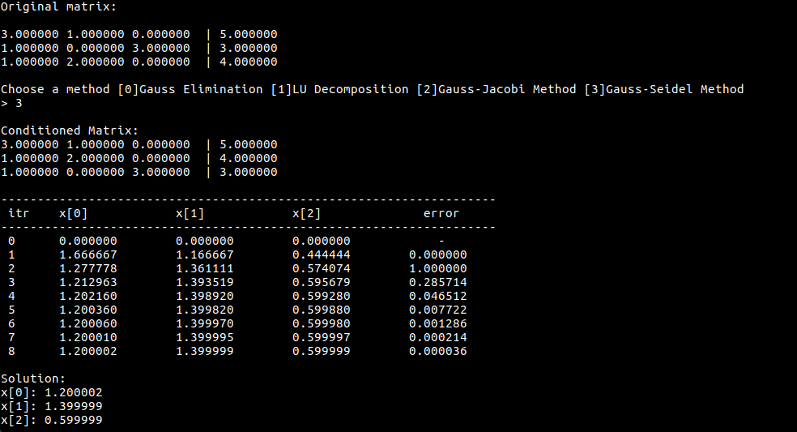

#Numeric Methods

College work for the discipline Numerical Calculus with the following methods implemented:<p\>

<b>Root-Finding Methods:<b\><p\>
 <a href="https://en.wikipedia.org/wiki/False_position_method">- Regula-Falsi Method;</a>
 <a href="https://en.wikipedia.org/wiki/Quasi-Newton_method">- Quasi-Newton Method;</a>
 <a href="https://en.wikipedia.org/wiki/Fixed-point_iteration">- Fixed Point Method;</a>
 <a href="https://en.wikipedia.org/wiki/Secant_method">- Secant Method;</a>
 <a href="https://en.wikipedia.org/wiki/Newton's_method">- Newton's Method;</a>
 <a href="https://en.wikipedia.org/wiki/Bisection_method">- Bissection Method.</a>

<b>Linear systems solver Methods:<b\><p\>
 <a href="https://en.wikipedia.org/wiki/LU_decomposition">- LU Decomposition;</a>
 <a href="https://www.cs.rutgers.edu/~venugopa/parallel_summer2012/ge.html">- Gauss Elimination;</a>
 <a href="https://en.wikipedia.org/wiki/Jacobi_method">- Jacobi Iterative Method;</a>
 <a href="https://en.wikipedia.org/wiki/Gauss%E2%80%93Seidel_method">- Gauss-Seidel Iterative Method.</a>

  

